# Anime List Management System


A Laravel project demonstrating relational database design using Eloquent ORM.
No frontend purely database structure and relationship practice.

---

## Diagrams

### One to One
`Users` → `Profiles`

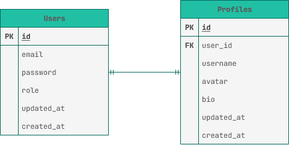

### One to Many
`Users` → `Reviews`, `Favorites`, `Ratings`, `Animes`

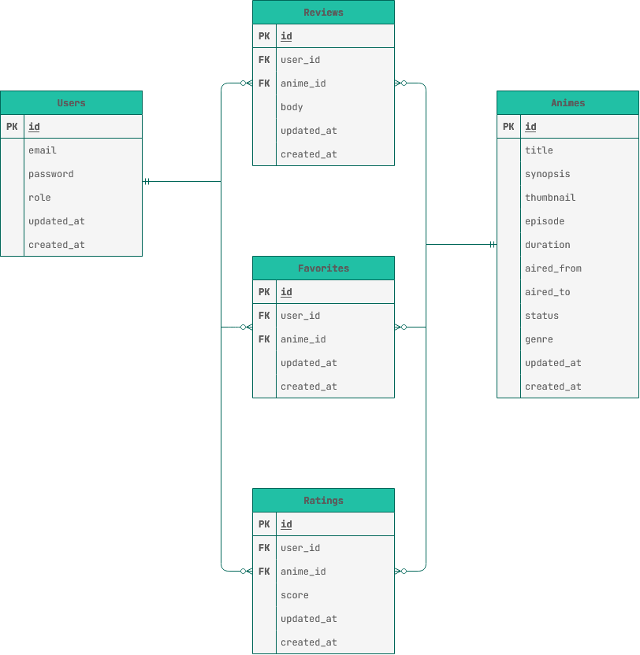

### Many to Many
`Animes` ↔ `Studios` via `Anime_Studio`

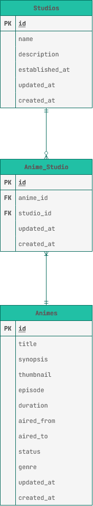

### Full ERD

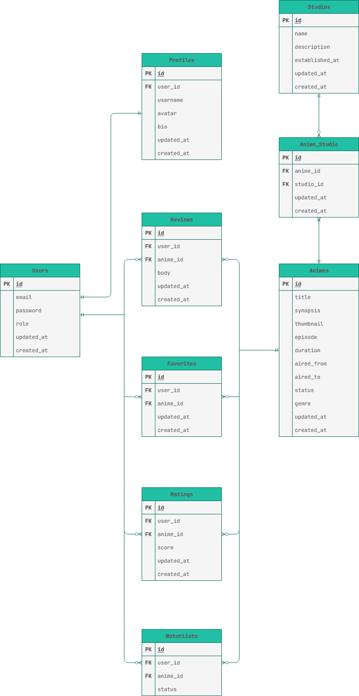

---

## Models

### User
```php
class User extends Model
{
    protected $fillable = ['name', 'email', 'password', 'role'];

    public function profile()
    {
        return $this->hasOne(Profile::class);
    }

    public function review()
    {
        return $this->hasMany(Review::class);
    }

    public function favorite()
    {
        return $this->hasMany(Favorite::class);
    }

    public function rating()
    {
        return $this->hasMany(Rating::class);
    }
}
```

### Profile
```php
class Profile extends Model
{
    protected $fillable = ['user_id', 'username', 'avatar', 'bio'];

    public function user()
    {
        return $this->belongsTo(User::class);
    }
}
```

### Anime
```php
class Anime extends Model
{
    protected $fillable = [
        'title', 'synopsis', 'thumbnail', 'episode',
        'aired_from', 'aired_to', 'duration', 'status', 'genre'
    ];

    public function review()
    {
        return $this->hasMany(Review::class);
    }

    public function favorite()
    {
        return $this->hasMany(Favorite::class);
    }

    public function rating()
    {
        return $this->hasMany(Rating::class);
    }

    public function animeStudio()
    {
        return $this->hasMany(AnimeStudio::class);
    }
}
```

### Studio
```php
class Studio extends Model
{
    protected $fillable = ['name', 'description', 'established_at'];

    public function animeStudio()
    {
        return $this->hasMany(AnimeStudio::class);
    }
}
```

### AnimeStudio
```php
class AnimeStudio extends Model
{
    protected $table = 'anime_studio';
    protected $fillable = ['anime_id', 'studio_id'];

    public function anime()
    {
        return $this->belongsTo(Anime::class);
    }

    public function studio()
    {
        return $this->belongsTo(Studio::class);
    }
}
```

### Review
```php
class Review extends Model
{
    protected $fillable = ['user_id', 'anime_id', 'body'];

    public function user()
    {
        return $this->belongsTo(User::class);
    }

    public function anime()
    {
        return $this->belongsTo(Anime::class);
    }
}
```

### Favorite
```php
class Favorite extends Model
{
    protected $fillable = ['user_id', 'anime_id'];

    public function user()
    {
        return $this->belongsTo(User::class);
    }

    public function anime()
    {
        return $this->belongsTo(Anime::class);
    }
}
```

### Rating
```php
class Rating extends Model
{
    protected $fillable = ['user_id', 'anime_id', 'score'];

    public function user()
    {
        return $this->belongsTo(User::class);
    }

    public function anime()
    {
        return $this->belongsTo(Anime::class);
    }
}
```

---

## Migrations

### create_users_table
```php
Schema::create('users', function (Blueprint $table) {
    $table->id();
    $table->string('name');
    $table->string('email');
    $table->string('password');
    $table->string('role');
    $table->timestamps();
});
```

### create_profiles_table
```php
Schema::create('profiles', function (Blueprint $table) {
    $table->id();
    $table->foreignId('user_id')->constrained()->cascadeOnDelete();
    $table->string('username');
    $table->string('avatar');
    $table->string('bio');
    $table->timestamps();
});
```

### create_animes_table
```php
Schema::create('animes', function (Blueprint $table) {
    $table->id();
    $table->string('title');
    $table->string('synopsis');
    $table->string('thumbnail');
    $table->decimal('episode');
    $table->date('aired_from');
    $table->date('aired_to');
    $table->decimal('duration');
    $table->string('status');
    $table->string('genre');
    $table->timestamps();
});
```

### create_studios_table
```php
Schema::create('studios', function (Blueprint $table) {
    $table->id();
    $table->string('name');
    $table->string('description');
    $table->date('established_at');
    $table->timestamps();
});
```

### create_anime_studio_table
```php
Schema::create('anime_studio', function (Blueprint $table) {
    $table->id();
    $table->foreignId('anime_id')->constrained()->cascadeOnDelete();
    $table->foreignId('studio_id')->constrained()->cascadeOnDelete();
    $table->timestamps();
});
```

### create_reviews_table
```php
Schema::create('reviews', function (Blueprint $table) {
    $table->id();
    $table->foreignId('user_id')->constrained()->cascadeOnDelete();
    $table->foreignId('anime_id')->constrained()->cascadeOnDelete();
    $table->string('body');
    $table->timestamps();
});
```

### create_favorites_table
```php
Schema::create('favorites', function (Blueprint $table) {
    $table->id();
    $table->foreignId('user_id')->constrained()->cascadeOnDelete();
    $table->foreignId('anime_id')->constrained()->cascadeOnDelete();
    $table->timestamps();
});
```

### create_ratings_table
```php
Schema::create('ratings', function (Blueprint $table) {
    $table->id();
    $table->foreignId('user_id')->constrained()->cascadeOnDelete();
    $table->foreignId('anime_id')->constrained()->cascadeOnDelete();
    $table->decimal('score');
    $table->timestamps();
});
```

---

## Installation

```bash
git clone https://github.com/xoptech/animelist-eloquent.git
cd animelist-eloquent
composer install
cp .env.example .env
php artisan key:generate
php artisan migrate:fresh
```

Then proceed to [Testing](#testing).

---

## Testing

All tests were done via `php artisan tinker`.

---

### Setup Create all data first

```php
$user = App\Models\User::create([
    'name'     => 'Satoru Gojo',
    'email'    => 'gojo@jjk.com',
    'password' => bcrypt('infinityvoid'),
    'role'     => 'user',
]);

App\Models\Profile::create([
    'user_id'  => $user->id,
    'username' => 'thehonored_one',
    'avatar'   => 'sixeyes.jpg',
    'bio'      => 'Throughout heaven and earth, I alone am the strongest.',
]);

$anime = App\Models\Anime::create([
    'title'      => 'Jujutsu Kaisen',
    'synopsis'   => 'Cursed energy, cursed spirits, and one blindfolded menace.',
    'thumbnail'  => 'jjk.jpg',
    'episode'    => 48,
    'aired_from' => '2020-10-03',
    'aired_to'   => '2021-03-27',
    'duration'   => 24,
    'status'     => 'finished',
    'genre'      => 'action',
]);

App\Models\Review::create([
    'user_id'  => $user->id,
    'anime_id' => $anime->id,
    'body'     => 'Sorry, but I\'m gonna have to be the one who saves the world. No hard feelings.',
]);

App\Models\Favorite::create([
    'user_id'  => $user->id,
    'anime_id' => $anime->id,
]);

App\Models\Rating::create([
    'user_id'  => $user->id,
    'anime_id' => $anime->id,
    'score'    => 9.8,
]);

$studio = App\Models\Studio::create([
    'name'           => 'MAPPA',
    'description'    => 'The studio brave enough to animate Gojo.',
    'established_at' => '2011-06-14',
]);

App\Models\AnimeStudio::create([
    'anime_id'  => $anime->id,
    'studio_id' => $studio->id,
]);
```

---

### User and Profile (One to One)

**Access profile from user**
```php
$user = App\Models\User::first();
$user->profile;
```
> `=> Profile { username: "thehonored_one", bio: "Throughout heaven and earth, I alone am the strongest." }`

**Access user from profile (inverse)**
```php
$user->profile->user;
```
> `=> User { name: "Satoru Gojo", email: "gojo@jjk.com" }`

---

### Reviews, Favorites, and Ratings (One to Many)

**Get reviews from user**
```php
$user = App\Models\User::first();
$anime = App\Models\Anime::first();
$user->review()->get();
```
> `=> Collection [ Review { body: "Sorry, but I'm gonna have to be the one who saves the world. No hard feelings." } ]`

**Get reviews from anime**
```php
$anime->review()->get();
```
> `=> Collection [ Review { body: "Sorry, but I'm gonna have to be the one who saves the world. No hard feelings." } ]`

**Access user from review (inverse)**
```php
$review = App\Models\Review::first();
$review->user;
```
> `=> User { name: "Satoru Gojo", email: "gojo@jjk.com" }`

**Access anime from review (inverse)**
```php
$review->anime;
```
> `=> Anime { title: "Jujutsu Kaisen" }`

---

**Get favorites from user**
```php
$user->favorite()->get();
```
> `=> Collection [ Favorite { user_id: 1, anime_id: 1 } ]`

**Get favorites from anime**
```php
$anime->favorite()->get();
```
> `=> Collection [ Favorite { user_id: 1, anime_id: 1 } ]`

**Access user from favorite (inverse)**
```php
$favorite = App\Models\Favorite::first();
$favorite->user;
```
> `=> User { name: "Satoru Gojo", email: "gojo@jjk.com" }`

**Access anime from favorite (inverse)**
```php
$favorite->anime;
```
> `=> Anime { title: "Jujutsu Kaisen" }`

---

**Get ratings from user**
```php
$user->rating()->get();
```
> `=> Collection [ Rating { score: "9.80" } ]`

**Get ratings from anime**
```php
$anime->rating()->get();
```
> `=> Collection [ Rating { score: "9.80" } ]`

**Access user from rating (inverse)**
```php
$rating = App\Models\Rating::first();
$rating->user;
```
> `=> User { name: "Satoru Gojo", email: "gojo@jjk.com" }`

**Access anime from rating (inverse)**
```php
$rating->anime;
```
> `=> Anime { title: "Jujutsu Kaisen" }`

---

### Anime and Studio (Many to Many)

**Get studios from anime**
```php
$anime = App\Models\Anime::first();
$studio = App\Models\Studio::first();
$anime->animeStudio()->get();
```
> `=> Collection [ AnimeStudio { anime_id: 1, studio_id: 1 } ]`

**Get animes from studio**
```php
$studio->animeStudio()->get();
```
> `=> Collection [ AnimeStudio { anime_id: 1, studio_id: 1 } ]`

**Access studio from anime (inverse)**
```php
$anime->animeStudio()->first()->studio;
```
> `=> Studio { name: "MAPPA" }`

**Access anime from studio (inverse)**
```php
$studio->animeStudio()->first()->anime;
```
> `=> Anime { title: "Jujutsu Kaisen" }`

---

### Screenshots

#### User and Profile (One to One)

`$user->profile`
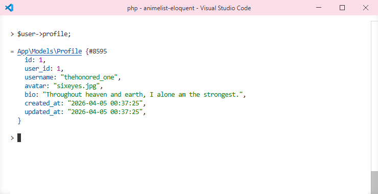

`$user->profile->user` (inverse)
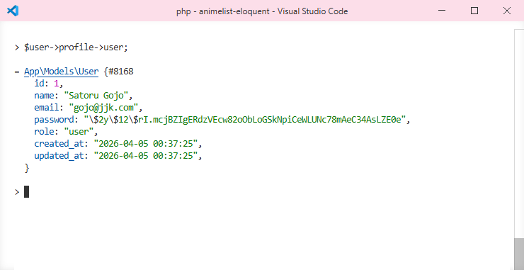

---

#### Reviews (One to Many)

`$user->review()->get()`
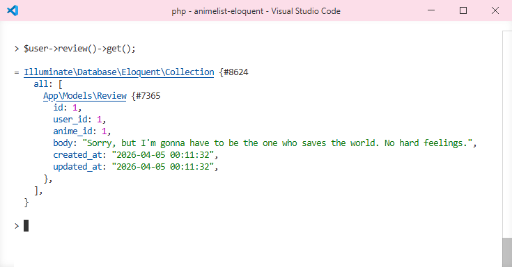

`$anime->review()->get()`
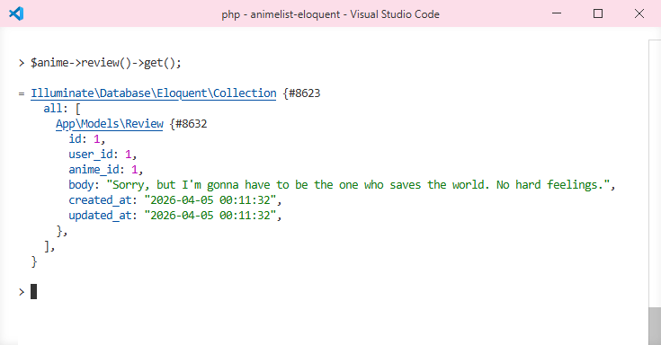

`$review->user` (inverse)
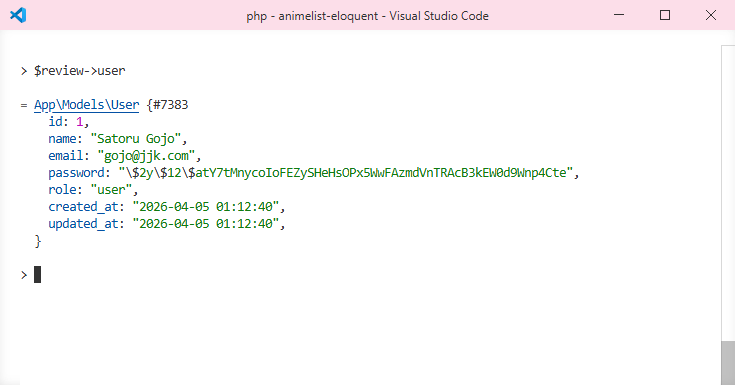

`$review->anime` (inverse)


---

#### Favorites (One to Many)

`$user->favorite()->get()`


`$anime->favorite()->get()`
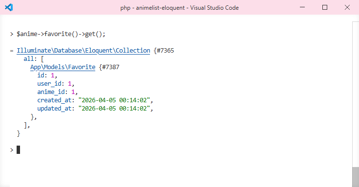

`$favorite->user` (inverse)
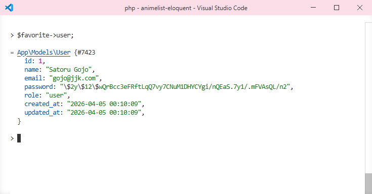

`$favorite->anime` (inverse)
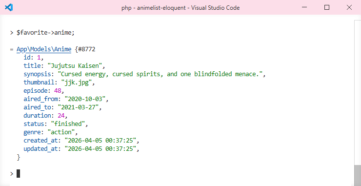

---

#### Ratings (One to Many)

`$user->rating()->get()`
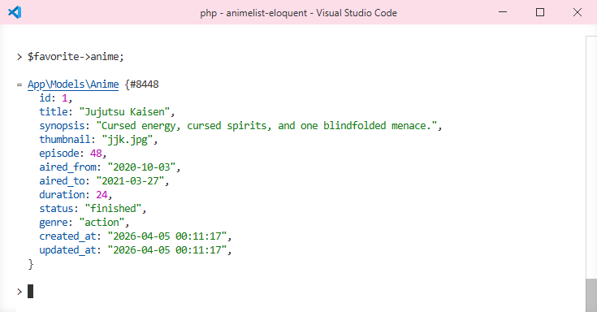

`$anime->rating()->get()`
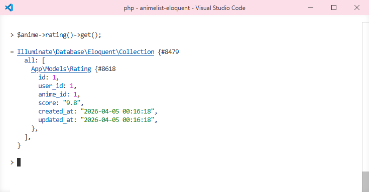

`$rating->user` (inverse)
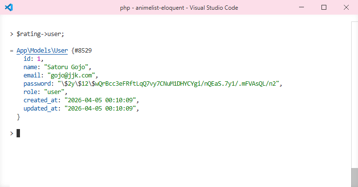

`$rating->anime` (inverse)


---

#### Anime and Studio (Many to Many)

`$anime->animeStudio()->get()`
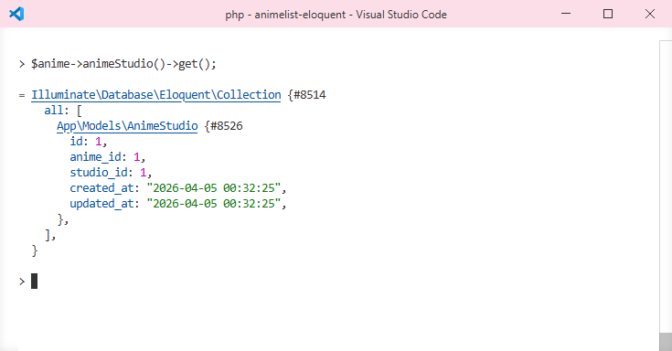

`$studio->animeStudio()->get()`


`$anime->animeStudio()->first()->studio` (inverse)
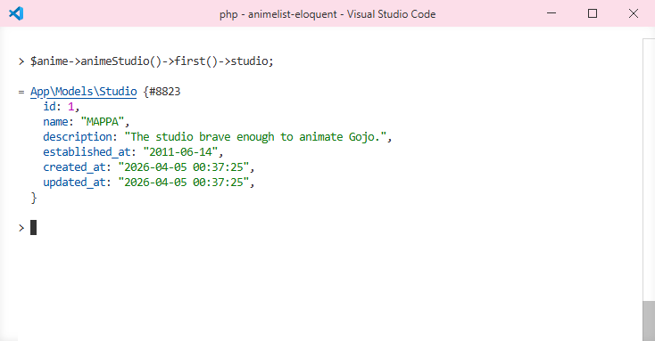

`$studio->animeStudio()->first()->anime` (inverse)
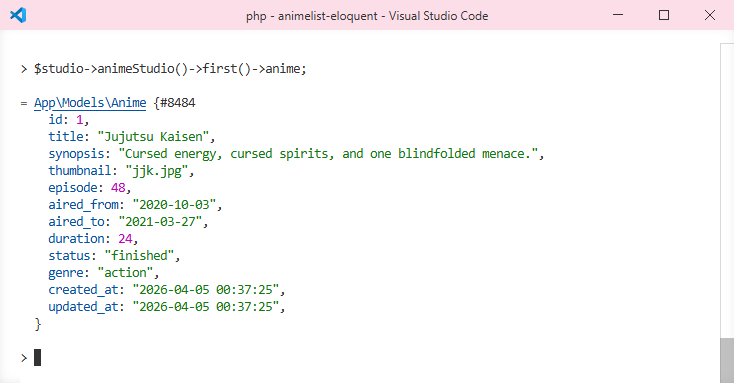
